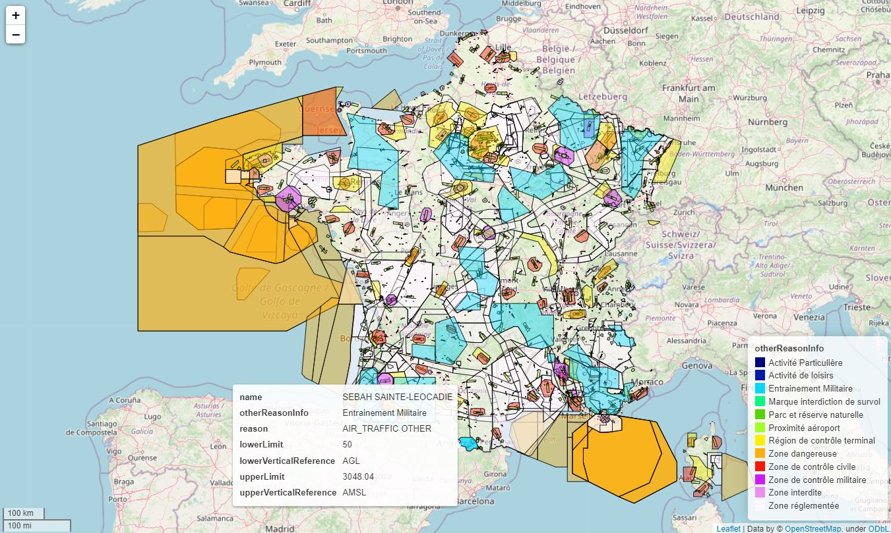

# Load and visualize UAS geographical zones of Metropolitan France

Commission implementing regulation (EU) 2019/947 of 24 May 2019 on the rules and procedures for the operation of unmanned aircraft stipulates that when Member States define UAS geographical zones (for safety, security, privacy or environmental reasons), they shall ensure for geo awareness purposes that the information ont the UAS geographical zones is made publicly available in a common unique digital format.
Following the French regulation of 3 December 2020 ("Arrêté du 3 décembre 2020 relatif à l'utilisation de l'espace aérien par les aéronefs sans équipage à bord"), UAS geographical zones active on French territory are published as Aeronautical Information Publication (AIP) provided by the French Aeronautical Information Service [SIA](https://www.sia.aviation-civile.gouv.fr/).
   The goal of these Python scripts is to build a GeoJSON file from these airspace data, and to visualize lateral areas of these UAS geographical zones on maps.  
 
Example 1: visualize UAS geographical zones on France map

Example 2: visualize UAS geographical zones with information on interactive map

Example 3: visualize Metropolitan France zones without UAS geographical zones 

## Running the tests

Run the notebook uas_geographical_zones.ipynb to load data and visualize UAS geographical zones on maps.
  Run the notebook without_uas_zones.ipynb to visualize zones in Metropolitan France without UAS geographical zones.

## Built With

The following Python libraries are used in these notebooks:
* [pandas](https://pandas.pydata.org/) - Python Data Analysis Library
* [GeoPandas](https://geopandas.org/en/stable/) - GeoPandas is an open source project which extends the datatypes used by pandas to allow spatial operations on geometric types.
* [Shapely](https://shapely.readthedocs.io/en/stable/manual.html) - Python package for computational geometry
* [contextily](https://github.com/darribas/contextily) - Context geo-tiles in Python

## Versions

This code was tested with following versions:
* Python 3.9.4, pandas 1.3.4, geopandas 0.10.2, contextily 1.1.0, shapely 1.7.1

## Authors

* **Thomas Dubot** 

## License

This project is licensed under the MIT License - see the [LICENSE.md](LICENSE.md) file for details

## Acknowledgments

UAS geographical zones are Aeronautical Information Publication data published by by the French Aeronautical Information Service SIA here: https://www.sia.aviation-civile.gouv.fr/

